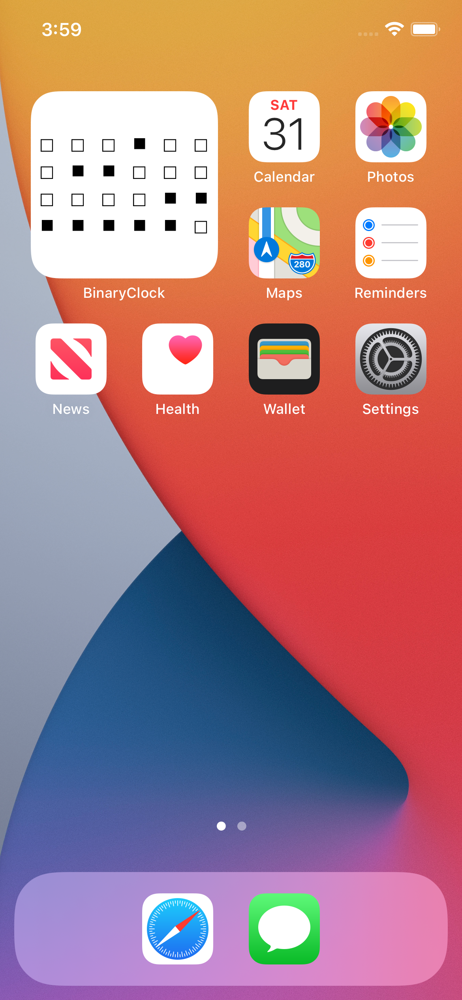
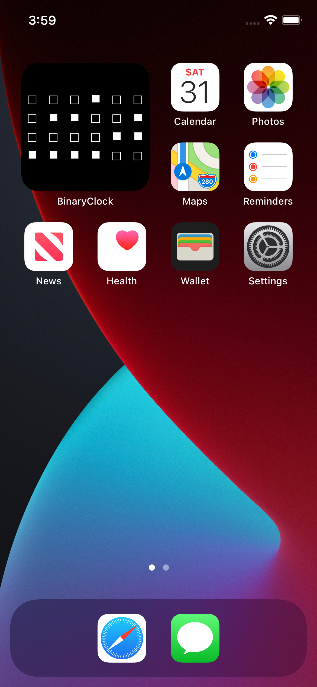

#  BinaryClock

Imagine my surprise when I could not find *any* binary clock widgets for iOS 14! Hence my
take on the classic, and most nerdiest, widget on any platform. I still have fond memories of
a binary clock on Gnome 2 toolbar -- those were happier days.

Light Mode | Dark Mode
:-----:|:------:
 | 
